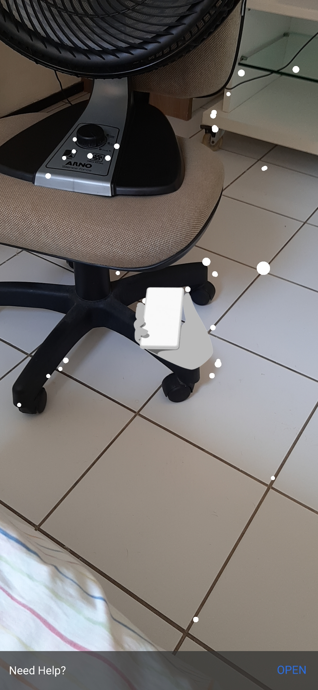
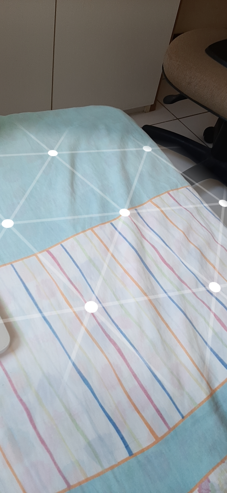
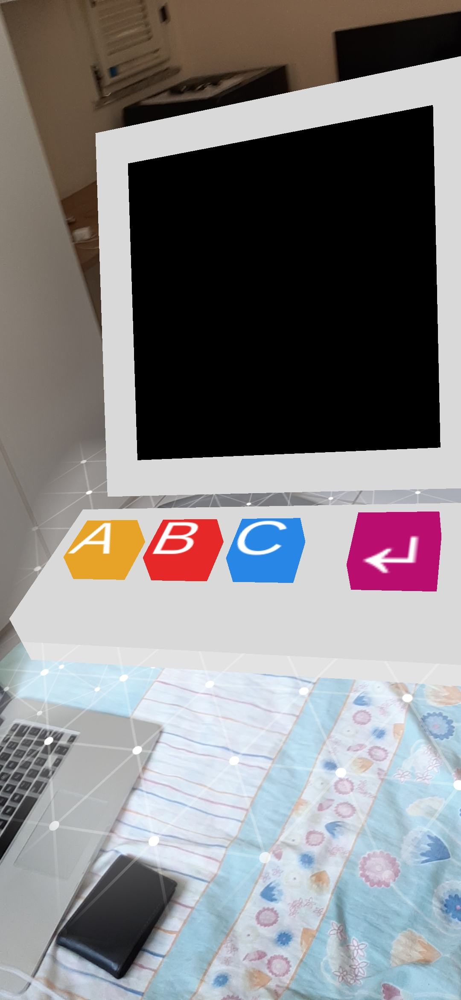
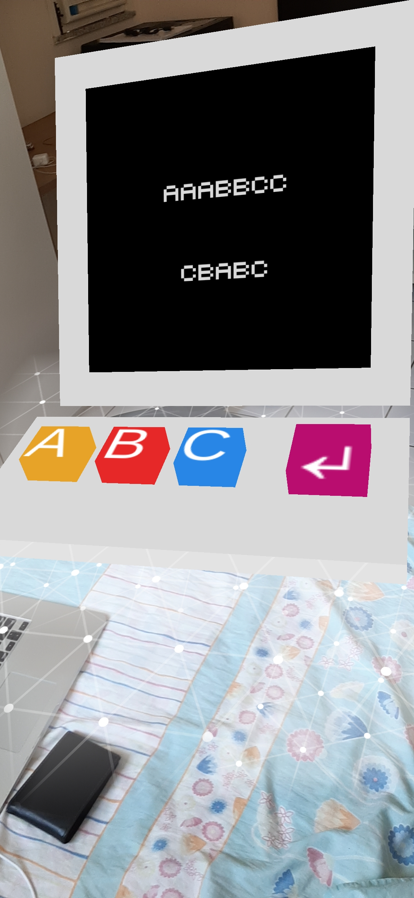

# Exemplo Unity ARCore
### Descrição
Pequena demonstração dos recursos básicos do 
[ARCore na Unity](https://developers.google.com/ar/discover). 

Consiste na criação de um teclado interativo 3D e uma tela que exibe 
as letras apertadas no teclado.

## Uso
### 1. Reconhecimento do ambiente

Após iniciar o programa, mova o celular ao redor do ambiente para que haja um 
reconhecimento de superfícies planas.

É necessário fornecer permissão para o uso da câmera. 

Os resultados serão mais eficientes em ambientes com iluminação adequada.

### 2. Reconhecimento do plano

Depois que o programa reconhecer as superfícies planas, ele irá desenhar uma malha branca.

### 3. Criação do teclado

Clique no plano mostrado na tela para criar um teclado 3D e um monitor.

Observação: o modelo 3D não utiliza o recurso de âncora disponível no ARCore, 
então pode acontecer de ele se distorcer ou sofrer pequenas variações de 
escala conforme a câmera muda de posição.

### 4. Interação com o teclado

Depois de criado, basta tocar em uma das quatro teclas (toque pela tela do celular!).

O resultado aparecerá no monitor.

